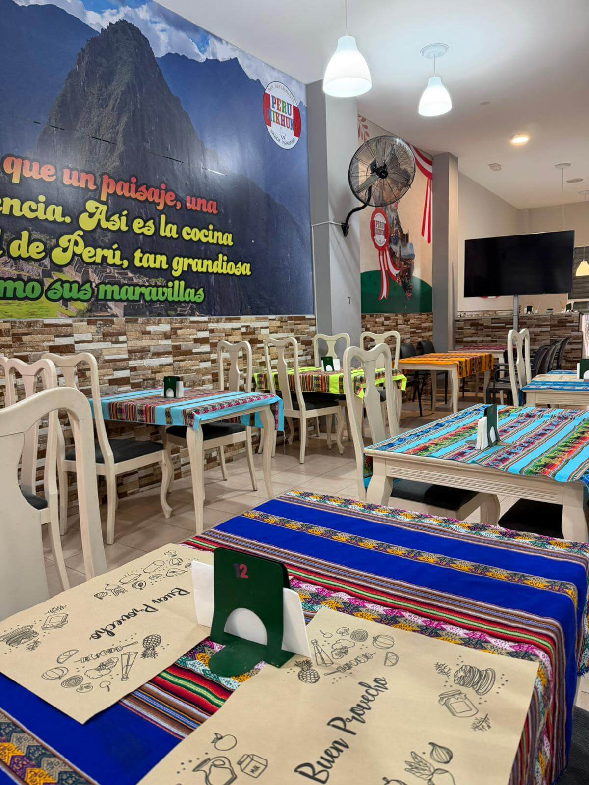

# 🇵🇪 Peru Mikhuna - Landing Page

¡Bienvenido al repositorio de **Peru Mikhuna**! Una página web moderna y elegante diseñada para resaltar la esencia de la gastronomía peruana en Inca. Este proyecto se enfoca en ofrecer una experiencia visual premium ("A1") para los clientes, facilitando la consulta de platos, horarios y contacto directo.

---

## 🚀 [Visita la página aquí](https://tousuario.github.io/tu-repositorio/)
*(Nota: Asegúrate de reemplazar este enlace con el link real de GitHub Pages una vez lo publiques)*

---

## ✨ Características principales

* **Diseño A1**: Estética elegante con una paleta de colores negro, dorado y rojo Perú.
* **Sección de Platos**: Galería visual de los platos estrella como el Ceviche, Jalea Mixta y Pollo a la Brasa.
* **Horarios Dinámicos**: Información clara sobre turnos de almuerzo y cena, con destaque especial para los domingos.
* **Contacto Directo**: Botones interactivos para llamar o enviar WhatsApp con un solo clic.
* **Totalmente Responsive**: Optimizado para que se vea perfecto en móviles, tablets y computadoras.
* **Firma Personalizada**: Crédito del desarrollador integrado en el pie de página.

## 🛠️ Tecnologías utilizadas

* **HTML5**: Estructura semántica para mejor SEO.
* **CSS3**: Estilos personalizados, efectos de transparencia (Glassmorphism), animaciones y Flexbox/Grid para el diseño.
* **Google Fonts**: Uso de la tipografía 'Poppins' para una lectura clara y moderna.
* **Font Awesome**: Iconografía profesional para contactos y horarios.

## 📸 Vista previa

## ✍️ Desarrollador
Este proyecto fue desarrollado y diseñado con orgullo por:
**Jorge Yataco Torres**

---

© 2026 Peru Mikhuna | Sabor Peruano
